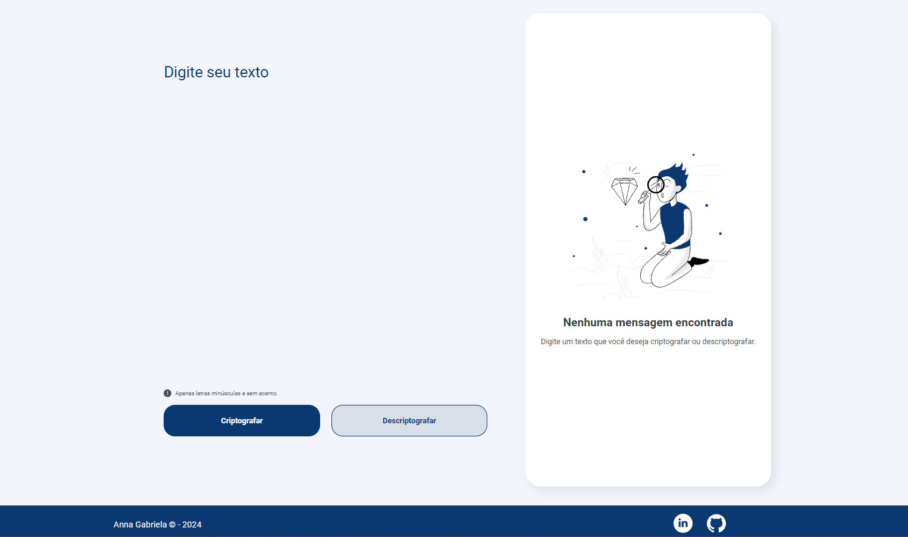
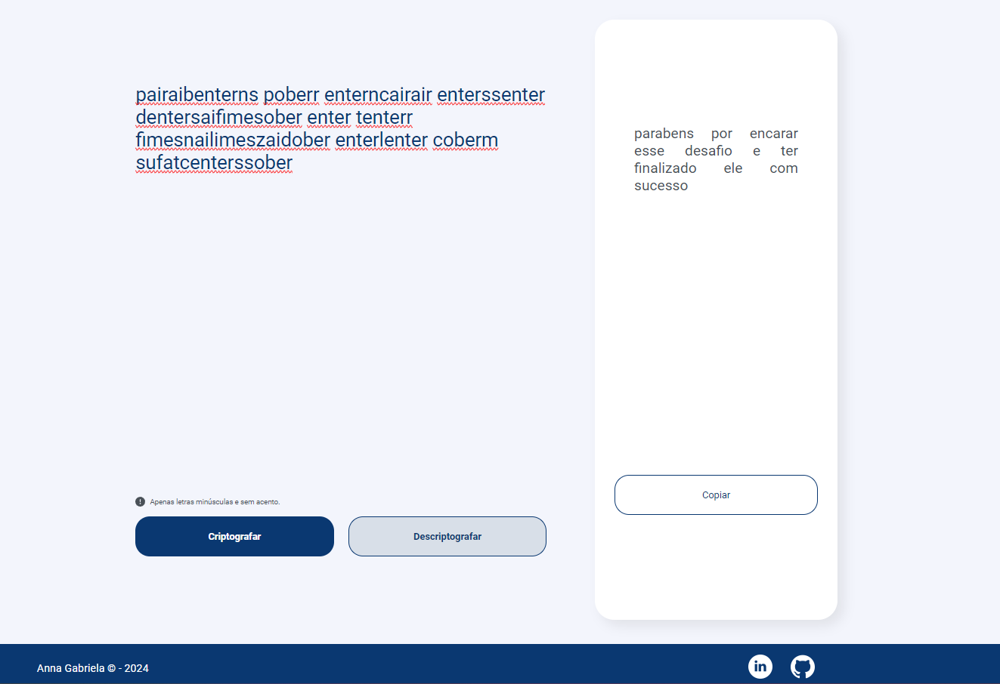

# Projeto Decodificador de Texto

## 1. O que é o Decodificador de Texto?
O projeto é um desafio para os alunos da Oracle Next education (ONE) e consistiu em desenvolver um Decodificador de Texto que deve criptografar e descriptografar palavras. 

As "chaves" de criptografia utilizadas são:

`A letra "e" é convertida para "enter"`

`A letra "i" é convertida para "imes"`

`A letra "a" é convertida para "ai"`

`A letra "o" é convertida para "ober"`

`A letra "u" é convertida para "ufat"`

**Os requisitos do projeto são:** 
 -  Deve funcionar apenas com letras minúsculas

- Não devem ser utilizados letras com acentos nem caracteres especiais

- Deve ser possível converter uma palavra para a versão criptografada e também retornar uma palavra criptografada para a versão original.

  - Por exemplo:
  
    `"gato" => "gaitober"`

    `gaitober" => "gato"`

- A página deve ter campos para inserção do texto a ser criptografado ou descriptografado, e a pessoa usuária deve poder escolher entre as duas opções

- O resultado deve ser exibido na tela.

**Extras:**

- Um botão que copie o texto criptografado/descriptografado para a área de transferência - ou seja, que tenha a mesma funcionalidade do ctrl+C ou da opção "copiar" do menu dos aplicativos.

## 2. Tecnologias Utilizadas

## 3. Tela Final

**Tela Inicial**

**Tela com Texto Criptografado**

